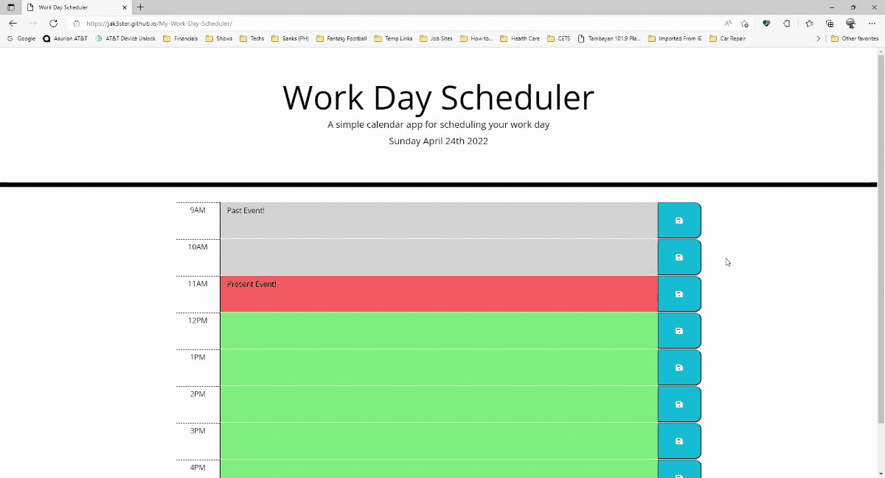

# My-Work-Day-Scheduler
Simple calendar application

## Description

This homework helped me create a simple calendar application that allows a user to save events for each hour of the day by modifying starter code. This app runs in the browser and feature dynamically updated HTML and CSS powered by jQuery.

The activities this week help familiarize moment.js library to work with date and time, jquery elements, UI widgets and interactions, click events, form elements, DOM traversal, event delegation, google fonts, bootstrap components, layout, utilities and extends.

## Installation

1. Download or clone repository
2. Open the main page (index.html) on your browser to view webpage
3. Use a text editor to view all coding, Visual Studio Code (recommended editor)

## Usage

1. Once My-Work-Day-Scheduler page launches
2. The current day is displayed at the top of the calendar
3. Scroll down and presented with timeblocks for standard business hours
4. Viewing the timeblocks for that day, each timeblock is color coded to indicate whether it is in the past, present, or future
5. Click into a timeblock and enter an event
6. Click the save button for that timeblock and the text for that event is saved in local storage
7 . Refresh the page and the saved events persist

## Features

* HTML
* CSS
* jQuery
* Bootstrap
* Moment.js

## Demo

## Website & Repository

* Deployed Link: https://jak3ster.github.io/My-Work-Day-Scheduler
* Github Repository: https://github.com/jak3ster/My-Work-Day-Scheduler